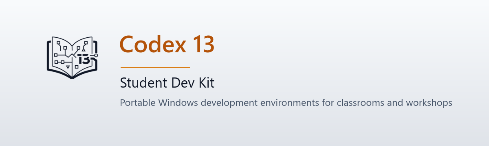
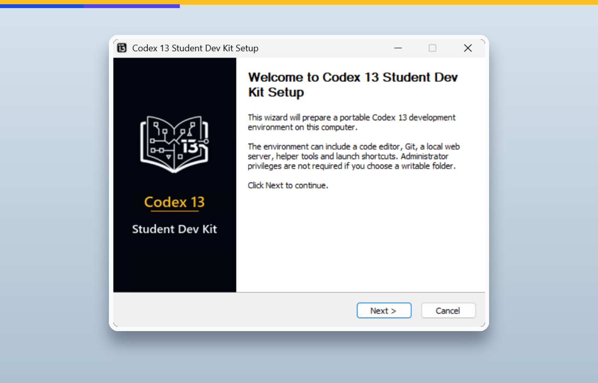
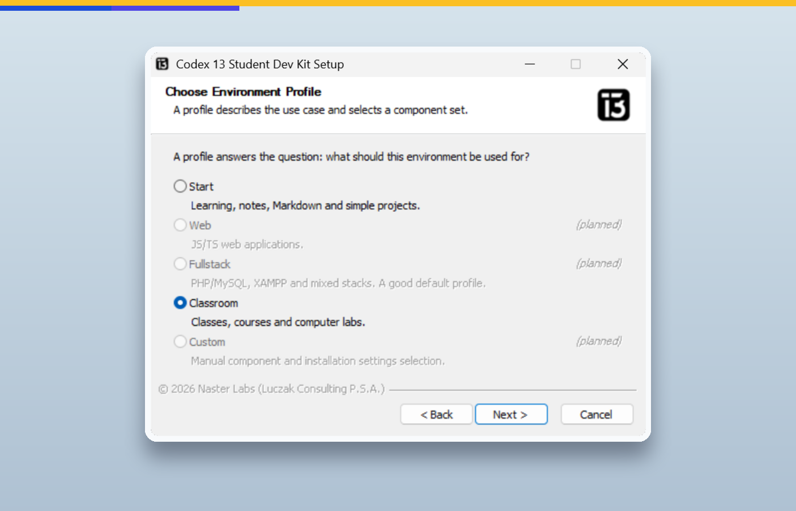
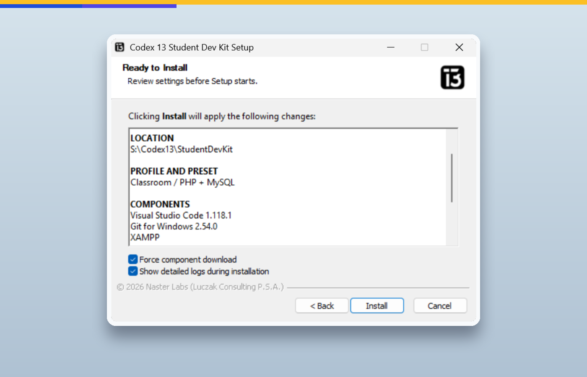
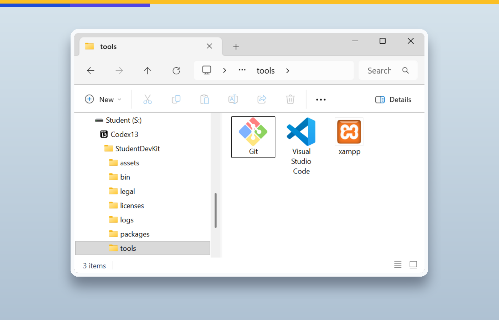
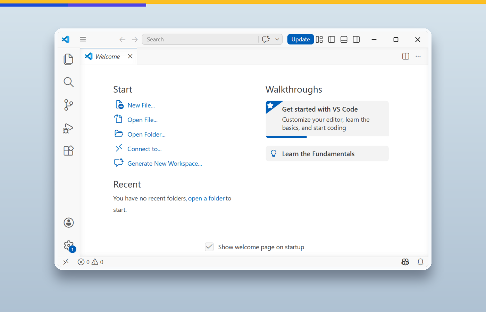

<div align="center">

<picture>
  <source media="(prefers-color-scheme: dark)" srcset="docs/assets/readme-header-dark.png">
  <source media="(prefers-color-scheme: light)" srcset="docs/assets/readme-header-light.png">
  
</picture>

[](https://github.com/nasterlabs/codex13-student-dev-kit/actions/workflows/ci.yml)
[](LICENSE)
[](https://github.com/nasterlabs/codex13-student-dev-kit)

An open-source project by **Naster Labs**, the software brand of **Luczak Consulting P.S.A.**

</div>

Codex 13 Student Dev Kit sets up a portable development environment toolkit
for students, classrooms, workshops and project-based learning in a
user-selected folder. The first public alpha installs portable VS Code, and in
the classroom profile also portable Git and XAMPP, without requiring
administrator rights when the target folder is writable.

> [!IMPORTANT]
>
> ## 🛠️ Transparency Disclaimer
>
> This repository is maintained in the open, including the imperfect parts of
> real software work: failed experiments, broken workflow runs, hurried fixes,
> accidental regressions, and decisions that only became obvious in hindsight.
>
> We do not rewrite history just to make the project look cleaner than it was.
> If something went wrong, it may remain visible in commits, pull requests,
> issues, workflow logs, tags or release artifacts.
>
> That is intentional. This project is also an educational record of how
> developer tooling is built over time: environments drift, CI catches surprises,
> infrastructure fails in creative ways, and sometimes a fix works locally before
> it works everywhere else.
>
> In short: this is a living engineering project, not a polished marketing
> artifact pretending everything always goes according to plan.

## What Is This?

Codex 13 Student Dev Kit helps prepare clean, repeatable development
environments for learning, workshops, classrooms and small projects.

The current alpha focuses on Setup: a Windows installer that installs selected
portable tools into one user-writable directory and starts them through Codex 13
launchers.

The broader roadmap includes:

- Setup - installation, reinstall/update and uninstall.
- Launcher - starting tools with a controlled per-process environment.
- Manager - ongoing environment management, profiles, presets, repairs,
  project workflows and classroom operations.

## Current And Planned Scope

| Area | Status | Notes |
| --- | --- | --- |
| Setup | Alpha | Installs portable VS Code, Git and XAMPP depending on profile. |
| Launcher | Alpha/basic | Starts tools without modifying global system PATH. |
| Manager | Planned | Environment management, repairs, workflows and project presets. |
| WSL / Docker / Podman | Planned | Future integration for more advanced development setups. |
| Dev Containers | Planned | Future support for project-based container workflows. |

All tools are unpacked under the installation directory and are started through Codex 13 launchers. The launchers set environment variables only for the started process, so multiple independent Dev Kit installations can coexist on one computer.

Setup is portable-first, not trace-free. It installs the tool payload under the selected installation directory, but it also creates per-user integration needed for a normal Windows installer: HKCU registry entries, an uninstall entry, Start Menu and optional desktop shortcuts, logs, legal files and `codex13-sdk.manifest.json`.

<p align="center">
  
</p>

## Screenshots

<table>
  <tr>
    <td width="50%">
      
      <br>
      <strong>Profile selection</strong>
    </td>
    <td width="50%">
      
      <br>
      <strong>Install summary</strong>
    </td>
  </tr>
  <tr>
    <td width="50%">
      
      <br>
      <strong>Portable tool folder</strong>
    </td>
    <td width="50%">
      
      <br>
      <strong>Launched VS Code</strong>
    </td>
  </tr>
</table>

## Status

Current release line: `0.7.1-alpha.<build_number>` · [Product page](https://codex13.dev/student-dev-kit)

The first public alpha builds are intended to be stable enough for release validation, but they also validate the public release pipeline itself. Until Authenticode signing for the EXE is resolved, public releases stay on the alpha line.

Alpha status means the installer is usable for validation, but profile coverage,
repair mode, component selection and signed releases are still being completed.

The installer downloads large upstream archives when they are not already
present in cache or in the `packages` folder next to the installer. Classroom
installs are substantially larger than Start installs because they include Git
for Windows and XAMPP.

## Requirements

Runtime:

- Windows 10 or Windows 11.
- No administrator rights required when using the default install location under
  `%LOCALAPPDATA%`; admin rights are needed only if you choose a system folder.
- Internet access for online installs, unless matching archives are supplied in
  the local `packages` folder next to the installer.
- Free disk space: approximately 300 MB for the Start profile (VS Code only),
  approximately 3 GB for the Classroom profile (VS Code, Git, and XAMPP).
- Visual C++ Redistributable 2019 or later — required by XAMPP in the Classroom
  profile; usually pre-installed on Windows 10 and Windows 11.

Development/build:

- Windows with PowerShell 7 or newer (`pwsh`).
- NSIS 3 with `makensis.exe`.
- Task (`winget install Task.Task`).
- Visual Studio Build Tools with C++ tools and Windows SDK when rebuilding the
  NSIS Naster Archive plug-in.

## Quick Start

1. Download `codex13-sdk_<version>_windows_x64_setup.exe` from the
   [latest release](https://github.com/nasterlabs/codex13-student-dev-kit/releases/latest).
2. Double-click the installer. No administrator rights are needed when using the
   default installation folder.
3. Follow the wizard: choose a profile (Start or Classroom), confirm the
   installation folder, and click Install.

The installer downloads and sets up all selected tools automatically and creates
Start Menu shortcuts.

## Quick Start For Developers

Install Task:

```powershell
winget install Task.Task
```

Install PowerShell 7 if `pwsh` is not already available:

```powershell
winget install Microsoft.PowerShell
```

Copy `.env.example` to `.env` and set your local `NSIS_PATH`, for example:

```text
NSIS_PATH=C:\Tools\nsis\makensis.exe
```

Run checks:

```powershell
task check
```

Install JavaScript development dependencies when working on commit tooling:

```powershell
task deps
```

Build the development installer:

```powershell
task build
```

More setup notes are in `docs/development.md`.

## Repository Layout

This repository is organized as a monorepo:

- `apps/setup/` - the current NSIS Setup application.
- `apps/setup/src/nsis/` - NSIS source, product config, localization, include files and RTF pages.
- `apps/setup/src/installer-scripts/` - PowerShell helpers embedded into or used by Setup.
- `apps/setup/src/payload/` - files copied into the installed Dev Kit.
- `apps/setup/src/patches/` - patch sources applied by Setup.
- `apps/setup/assets/` - Setup-specific generated assets.
- `apps/setup/vendor/` - vendored binaries used by Setup.
- `packages/nsis-naster-archive/` - custom NSIS archive plug-in package.
- `tools/scripts/` - repo-level checks and maintenance scripts.
- `tools/dev/` - local developer machine helpers.
- `assets/brand/` - shared brand source assets.

The future Manager application will live under `apps/manager/`.

## Supported Components

Currently installable:

- Visual Studio Code portable, pinned to `1.118.1`.
- Git for Windows portable, pinned to `2.54.0`.
- XAMPP portable, pinned to `8.2.12`.
- Codex 13 launchers, legal files, logs, manifest and shortcuts.

Planned for later releases:

- OpenSSH for Windows portable.
- Node.js portable.
- ImageMagick.

Planned components stay hidden until their URL, pinned version, SHA256, extraction behavior, preservation policy and sanity checks are wired.

## Profiles

Profiles answer: what do we install?

Available in this release:

- `Start` - light environment for learning, notes, Markdown and simple projects. Active preset: `Clean VS Code` / `Czysty VS Code`; installs only portable VS Code and Codex 13 launchers.
- `Classroom` - classroom, courses and repeatable lab machines. Active preset: `PHP + MySQL`; installs portable VS Code, portable Git for Windows and portable XAMPP.

Shown as planned (disabled in the wizard):

- `Web` - modern JavaScript/TypeScript web work. Requires Node.js (planned component).
- `Fullstack` - PHP/MySQL and mixed stacks.
- `Custom` - manual component and shortcut selection.

## Presets

Presets answer: how do we configure the selected profile? In this release each active profile has exactly one active preset:

- Start: `Clean VS Code` / `Czysty VS Code`.
- Classroom: `PHP + MySQL`.

Planned presets shown as disabled in the wizard include Start `Codex 13 Basic`, Start `Markdown / Notes`, Web `Frontend React / Vite`, Web `Backend Node / API`, Web `Static Site`, Fullstack presets, Classroom `INF.03 - podstawy web`, Classroom `Node API`, and Custom `Manual`.

The selected preset is written to `codex13-sdk.manifest.json`. Setup currently applies conservative VS Code defaults and launcher behavior only; richer workflow configuration belongs to the future Manager.

## Installer Flow

The Setup wizard runs in Polish or English, depending on the Windows system language.

1. Welcome.
2. Terms and Privacy.
3. Installation folder.
4. Existing Installation — when an existing install is detected.
5. Environment profile.
6. Configuration preset.
7. Existing Components - when existing VS Code or XAMPP folders/data are found.
8. Ready to Install.
9. Installation or uninstall progress.
10. Environment Ready.

There is no manual component-selection page in this release. A component page exists in the codebase as planned work, but it is hidden for the first alpha. The current wizard exposes install choices through profile and preset selection:

- `Start` / `Clean VS Code` installs portable VS Code and base Setup files.
- `Classroom` / `PHP + MySQL` installs portable VS Code, portable Git for Windows, portable XAMPP and base Setup files.

Repair mode is planned and disabled in this release. Existing installations can currently be reinstalled/updated with data preservation defaults, or removed with uninstall options.

There is no separate Start Menu folder page. Setup always creates:

```text
Codex 13 Student Dev Kit
```

Only shortcuts with existing targets are created.

## Data Preservation

Destructive actions are not selected by default.

Default strategies:

- VS Code: refresh program files only when requested, preserve `tools\VSCode\data`.
- Git: keep and verify existing portable installation.
- XAMPP: keep existing installation by default, or refresh program files while preserving `htdocs` and `mysql\data`.
- OpenSSH: planned.
- Node.js: planned strategy is refresh program files while preserving npm/pnpm config and cache.
- ImageMagick: planned strategy is refresh or reinstall when no user data exists.

Protected data includes VS Code user data and extensions, Git configuration, XAMPP projects and databases, and in future releases SSH keys, npm/pnpm config/cache, and modified ImageMagick policy/delegate files.

## Modes

When an installation is detected, Setup offers:

- `Reinstall or update` - choose profile and preset; preserve existing data by default.
- `Remove Codex 13 Student Dev Kit` - run uninstall options; user data is preserved unless explicitly selected.

Repair mode is planned and currently shown as disabled. It is also disabled in the Windows uninstall metadata for this release. Uninstall removes program files and launchers by default. Cache, logs, VS Code data, XAMPP `htdocs`, and XAMPP `mysql\data` are preserved unless explicitly selected. Removing the whole install directory or MySQL data requires an extra warning.

## Cache and SHA256

Setup checks package cache before downloading:

1. Check local install cache.
2. If an archive exists, verify SHA256.
3. If no valid cache entry exists, check the `packages` folder next to the installer.
4. Reuse or copy the archive when SHA256 is valid.
5. Delete and redownload when SHA256 is invalid.
6. Respect forced download from the summary page by deleting the install cache copy first.
7. Verify SHA256 again after download.
8. Write decisions and verification results to the install log.

In the current alpha installer, kept existing components run a control-file
check for their installed executable before Setup skips re-extraction. That
means an existing VS Code, Git, OpenSSH or XAMPP install is kept without
downloading or verifying its archive again unless refresh/remove is selected for
that component or forced download is selected for a component that will actually
be installed from an archive.

For offline or classroom installs, place archives next to the installer:

```text
packages\vscode-1.118.1.zip
packages\xampp-8.2.12.zip
packages\PortableGit-2.54.0-64-bit.7z.exe
```

For unattended install, place `codex13-sdk.unattended.ini` next to the installer. The file is all-or-nothing: when every required answer is valid, Setup applies the whole configuration automatically; otherwise it ignores the file and shows the normal manual wizard with no preselected answers from the invalid file. See [docs/setup/unattended.md](docs/setup/unattended.md).

## Manifest

Setup writes:

```text
codex13-sdk.manifest.json
```

The manifest is a required installation artifact. In schema version 1 it records: `schemaVersion`, `manifestName`, `product`, `installedAt`, absolute `installRoot`, install `mode`, selected `profile`, selected `preset`, detected installed `components`, shortcut contract, VS Code portable-data settings, VS Code launcher PATH behavior and absolute `logPath`.

Component entries are detected from installed control files and include component id, name, version, relative path, status and preservation strategy. The strategy is the current component policy, not a per-run action log. The manifest does not record `forceDownload`, whether the run was unattended, or individual preservation checkbox values. Absolute manifest paths can include the Windows user profile or another user-selected directory name; they stay local and are described in the privacy notice. The future Manager will use the manifest as the stable description of the installed Dev Kit. See [docs/setup/manifest.md](docs/setup/manifest.md).

## Launchers

Setup does not modify the global system PATH.

Launchers set PATH only for the started process. The VS Code launcher adds Dev Kit tools when they exist:

```text
tools\Git\cmd
tools\Git\bin
tools\Node
tools\xampp\php
tools\ImageMagick
```

VS Code is launched with portable data directories:

```text
tools\VSCode\data\user-data
tools\VSCode\data\extensions
```

## Build

Builds currently require Windows tooling because the Setup application is an
NSIS installer.

The preferred entry point is Task:

```powershell
task build
```

You can also call the Windows wrapper directly:

```powershell
.\apps\setup\scripts\build.cmd
```

or, when using the Windows PowerShell fallback explicitly:

```powershell
powershell.exe -NoProfile -ExecutionPolicy Bypass -File .\apps\setup\scripts\build.ps1
```

The dev installer is written to:

```text
dist\setup\Codex13SDK-Setup-dev.exe
```

Release build notes are in `docs/release.md`.

## License

The main Codex 13 Student Dev Kit project code is licensed under the Apache
License 2.0. The root `LICENSE` file applies to repository content except where
`.reuse/dep5` records a more specific per-path license.

Some files are intentionally under different terms, including the MIT-licensed
NSIS Naster Archive package and the GPL-2.0-only XAMPP patch set. The installer
also downloads third-party tools such as Visual Studio Code, Git for Windows and
XAMPP; those tools are not relicensed by this project and remain governed by
their own upstream license terms and notices. Third-party details are summarized
in `docs/licensing.md` and `docs/third-party.md`.

## Contributing And Security

Contributions are welcome. This project uses [GitHub Flow](https://docs.github.com/en/get-started/quickstart/github-flow), [Conventional Commits](https://www.conventionalcommits.org/), and [DCO](https://developercertificate.org/) sign-off. Run `task check` before opening a pull request.

- [CONTRIBUTING.md](CONTRIBUTING.md) — contribution guide
- [SECURITY.md](SECURITY.md) — reporting vulnerabilities privately
- [SUPPORT.md](SUPPORT.md) — getting help
- [CODE_OF_CONDUCT.md](CODE_OF_CONDUCT.md) — community standards
- [docs/licensing.md](docs/licensing.md) — license and notice structure
- [docs/third-party.md](docs/third-party.md) — third-party licenses

## Support

If Codex 13 Student Dev Kit is useful to you, consider [sponsoring the project](https://github.com/sponsors/lukaszpiotrluczak).
Sponsorship helps cover project infrastructure, including future release
signing costs if a free open-source signing path is not available.
